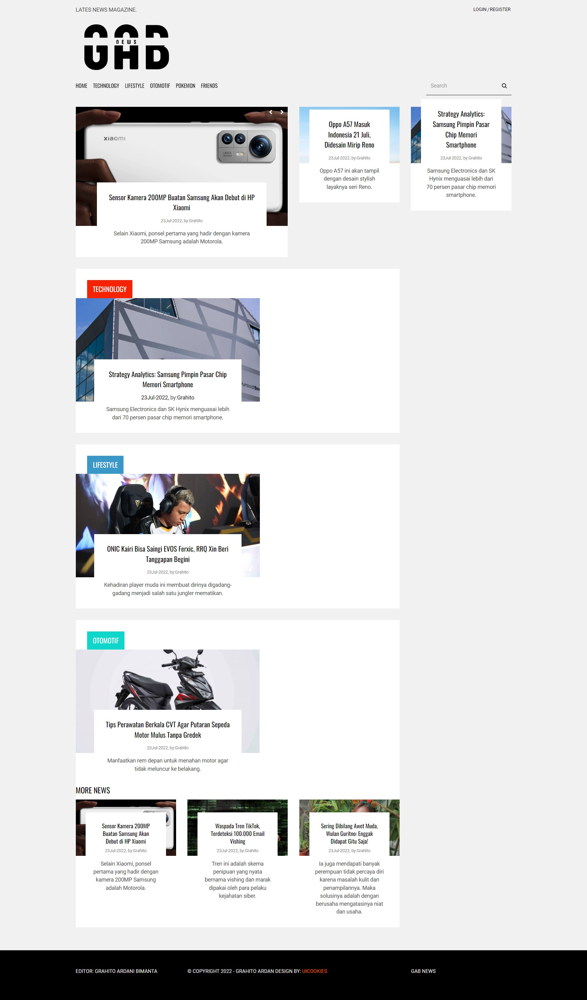

**Grahito Ardani B | IT-0202 | 1202199006**

## Phase 1  | How To Install Laravel 9 on Windows

<details> <summary> Required XAMPP for Windows</summary>

### Install from www.apachefriends.org
- [Installer XAMPP](https://www.apachefriends.org/xampp-files/8.1.6/xampp-windows-x64-8.1.6-0-VS16-installer.exe)    `Windows 2008, 2012, Vista, 7, 8 (Important: XP or 2003 not supported`
    
    **Component Install**: MySQL, phpMyAdmin

</details>

<details> <summary> Required Composer for Windows</summary>

- [Installer Composer](https://getcomposer.org/Composer-Setup.exe)
- After downloading the Composer file, open the file and follow the installation instructions below: 
   First, a page like the one in the image above will appear. Click Next to continue with the installation process.
- Make sure to select the installation location Composer running at C:\xampp\php\php.exe. Click Next if the php file location is correct.
- After that, you'll be asked if you want to utilize a proxy or not. Click the button and input your proxy URL if you want to use one. If you don't wish to use a proxy, proceed with the installation by clicking Next.
- Next, double-check that the installation process is operating in the correct directory, which is C:xamppphpphp.exe. If everything seems good, click Install. The next screen displays a notification that the Windows environment has changed. This modification makes it possible to run Composer from the Command Prompt.
- When the installation is finished, close the Composer installation window by clicking Finish.
- Following the completion of the Composer installation, use the Command Prompt to verify the Composer installation. The key is to press Win + R, type cmd, and then click Ok. 
- After that, you'll be taken to the Command Prompt window. To see if the installation was successful, run the command below.
   Your installation was successful if it looks like the image above.
</details>
<br>

- **Make sure you have installed composer and xampp.**
- Entering the Command Prompt is the first step in installing Laravel. The trick is to press Win+R, type cmd, and then press OK.
- Navigate to the file server directory in Command Prompt or Terminal before installing Laravel. On XAMPP, the file server is located in the xampp/htdocs directory by default. To get to the htdocs directory, type this command in the Command Prompt window.
    ```
    cd \xampp\htdocs 
    ```  
- Before you install Laravel, go to the file server directory using Command Prompt or Terminal. The xampp/htdocs directory is the default location for the file server in XAMPP. To get to the htdocs directory, type this command in the Command Prompt window.
    ```
    composer create-project --prefer-dist laravel/laravel project_name 
    ```  
    Composer will begin the process of gathering data and installing Laravel into the directory you chose if the command was successfully entered. Ensure that your internet connection is reliable so that the Laravel data retrieval procedure goes without a hitch.
- After the Laravel file download is complete, a new folder with the same name as the project name you provided in the /xampp/htdocs folder will appear in the file server directory.
- Navigate to the directory you created earlier in Command Prompt or Terminal to confirm that Laravel is successfully installed and ready to use.
    ```
    cd project_name
    ```  
    Then, at the Command Prompt or Terminal, type the following command:
    ```
    php artisan serve
    ```  
- The next step is to open the link supplied by Laravel if it indicates Laravel development server started in the Command Prompt or Terminal. By default, you'll be sent to 127.0.0.1:8000, which is the server address. A homepage with Laravel writing in the center will appear later, as illustrated in the image below:

## Phase 2 

- on Db include 2 table rss and news.
- in this phase im using 3 rss 
- 'name' => 'Tekno',
  'url' => "https://www.suara.com/rss/tekno"
  'name' => 'Otomotif',
  'url' => "https://www.suara.com/rss/otomotif"
  'name' => 'Lifestyle',
  'url' => "https://www.suara.com/rss/lifestyle"


## Phase 3

- in home page i show all news of 3 rss
- <p align="center"></p>
- and i show in every category
- Technology
  <p align="center"></p>
-Lifestyle
  <p align="center"></p>
-Otomotif
  <p align="center"></p>

## Final Exam
-I make new page and show the pokemon API 
-on the pokemon page i show image, type the pokemon and pokemon skill
<p align="center"></p>
